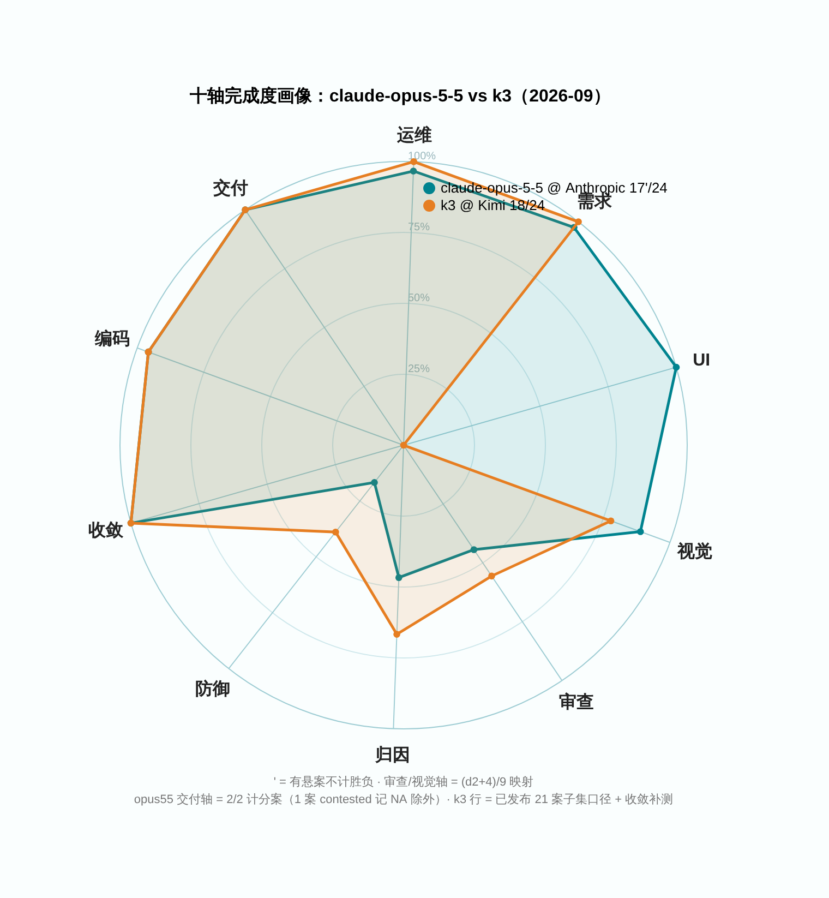

# amber-claude

用私有题库 **AMBER** 实测 Anthropic Claude 系列模型，只公开结果，不公开题目。
English: [README.en.md](README.en.md)

> **一句话**：我们给 AI 模型出「真实工作考卷」——修 bug、查事故原因、看系统截图挑毛病、真上手运维——这个仓放 **Anthropic Claude 模型**的成绩单。最新一期：Claude Opus 5.5 发布当天首考，24 案过 17 案（案 = 一道题）；另有 1 案它已经把事故原因答对了，却突然触发安全拒答——按规矩这案记「悬案」，不算赢也不算输。

## 这是什么

- 每期一篇 `results/YYYY-Www.md`：同一套题、同一套考试程序（harness，自动让模型做题并记分的工具），对目标模型跑全库；同名模型跨厂商并排。
- 一期固定报告：题集规模与哈希（hash = 防偷换题目的指纹）、每题（案）的 d2 分（我们的打分，算法不公开）与通过 / 失败、终端终态（程序跑完时的退出状态）、token 用量与成本（按量计费的渠道如实报价；订阅渠道无单价表，不报美元）、时延、环境指纹、按证据纪律写的定性裁决。
- 题目、oracle（判分器）、transcript（答题全过程记录）、中间产物**永不公开**（见下「发布纪律」）。
- AMBER 是 agentic 实战题库（施工 / 运维 / 审查 / 视觉 / 需求漂移——题中要求中途变化），规范与制题工具见 [getaskclaw/amber](https://github.com/getaskclaw/amber)；考题本体私有。
- 「道」= 同一个模型名在不同家的卖场 / 接口；「effort 档」= 给模型设置的思考力度档位。跨仓比较时，同名模型在不同「道」上可能是不同端点，引用一律带日期与档位声明。

## 姐妹仓

[amber-gpt](https://github.com/getaskclaw/amber-gpt) · [amber-kimi](https://github.com/getaskclaw/amber-kimi) · [amber-commandcode](https://github.com/getaskclaw/amber-commandcode) · [amber-nous](https://github.com/getaskclaw/amber-nous) · [amber-deepseek](https://github.com/getaskclaw/amber-deepseek) · [amber-doubao](https://github.com/getaskclaw/amber-doubao) · [amber-stepfun](https://github.com/getaskclaw/amber-stepfun) · [amber-ollama](https://github.com/getaskclaw/amber-ollama) · [amber-crof](https://github.com/getaskclaw/amber-crof) · [amber-opencode](https://github.com/getaskclaw/amber-opencode) · [amber-workbuddy](https://github.com/getaskclaw/amber-workbuddy) · [amber-goldenpotato](https://github.com/getaskclaw/amber-goldenpotato) · [amber-devin](https://github.com/getaskclaw/amber-devin)

## 最新成绩

- **2026-W39** — claude-opus-5-5 全库首考 **17'/24**（`'` = 有悬案不计胜负；写全 = 17 胜 · 6 负 · 1 悬）：[正刊](results/2026-W39.md)（[English](results/2026-W39.en.md)）

## 发布纪律（红线）

1. 只发：分数与聚合、token 用量与成本、速度、定性裁决。
2. 永不发：题目内容、oracle / 判分器、transcript、考生工作区、任何能复原题面的中间产物。
3. 每期必钉：模型 ID、effort 档、日期（UTC）、harness 版本、每案内容哈希（bundle_sha，每题内容的哈希指纹）。哈希用于对照 [amber](https://github.com/getaskclaw/amber) 的公开哈希清单，自证题集未变。
4. 案号与题目结构属私有面：公开结果里案例只用稳定别名（A-xxxxxxxx，哈希派生）+ bundle 哈希作句柄；内部案号、变体名、题目描述永不出现。
5. 基调：这是社区实测，不是对厂商的攻击。数据说话，措辞克制。

## 一个方法论前提

同名模型、同 provider，两次跑也可能不同分——推理参数、负载、服务端版本都在漂。所以这里的一切结论都带日期与档位，且定期重测。单日数字是快照，不是定律。
