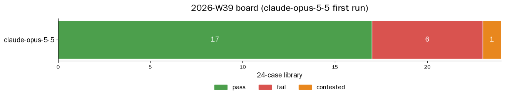
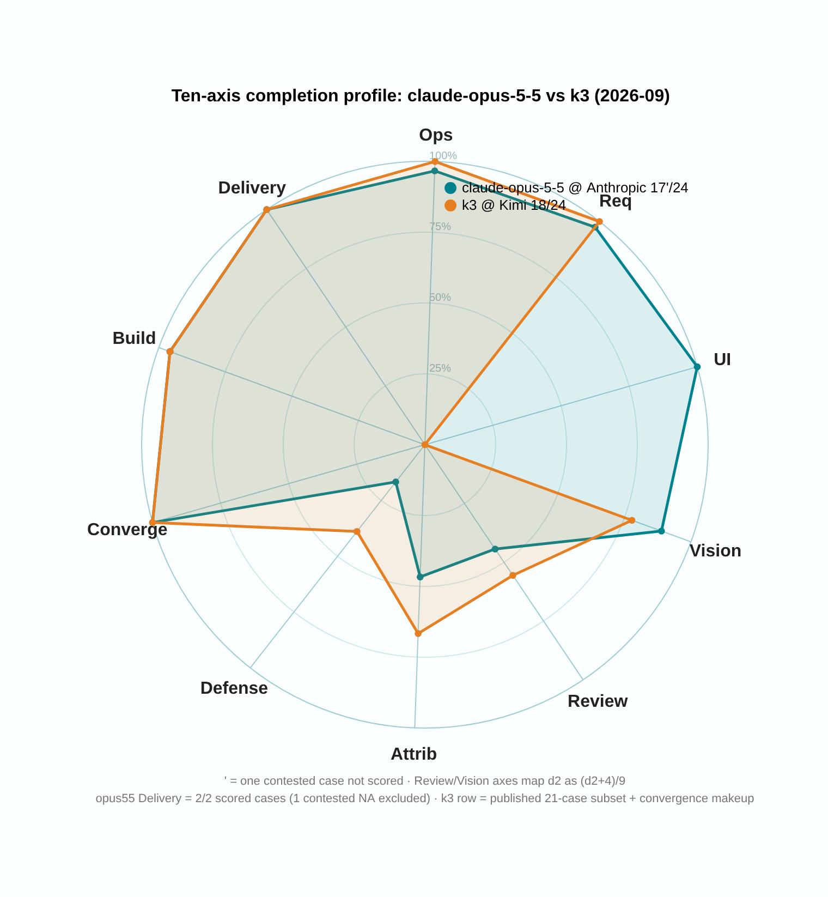

# 2026-W39 — claude-opus-5-5 first full-library run (tested on launch day)

> Correction: A-1fd3683a is invalid / NA due to test-harness infrastructure: original answer not saved, zero-traffic gate misclassification. Refusal remains a diagnostic observation only; the owner has withdrawn the safety-boundary deployment advice. 17 wins · 6 losses · 1 void case. ' = contested (held for safety refusal) or invalid (infrastructure-related (test harness or scoring environment) cases: held, void or awaiting re-scoring); neither counts as a win or a loss. Every lane with NA carries an apostrophe, including frozen display rows; a hold does not settle the cause. [Correction](2026-W39-correction.en.md) replaces the old claims below.

**Summary**: Anthropic released Claude Opus 5.5 on 2026-09-22 ([Reuters](https://www.reuters.com/business/anthropic-unveils-claude-opus-55-2026-09-22)), and we ran the full AMBER library the same day: 27 papers in a ~50-minute scoring window, score **17 pass · 6 fail · 1 contested**, cut-off checks found **0 wrongfully killed papers** (every session closed cleanly, zero rate limits). The single contested case is itself the headline: on A-1fd3683a the model first located the right root cause, then hit a safety refusal; re-probed the same day with the same question, it answered in full — the safety boundary here is probabilistic. Under our disclosure rules this paper is scored **NA**, counts as neither pass nor fail, and stays on the case list forever. The strengths are just as real: UI-build case A-d9b79b46 at a **perfect 12/12**, 5 of 6 ops cases passed, requirement-drift 4/4 all green. The weaknesses are reported as-is: review case A-cdc3d11a reached the right verdict but 18 false positives dragged its score to -17; the attribution case A-a317e74b got only 7/15. This is a subscription lane with no price sheet, so we report no dollar cost.

中文: [2026-W39.md](2026-W39.md)

---

## Run identity

| field | value |
|---|---|
| model | `claude-opus-5-5` |
| provider | Anthropic (Claude subscription lane, OAuth) |
| band | high (effort pass-through verified: changing the band changes completion behavior and thinking-token accounting) |
| window (UTC) | 2026-09-22 17:51 → 18:58 (the first attempt triggered the exam room's zero-traffic protection and was aborted; the full run restarted at 18:08; scoring window ≈50 min, 2 workers) |
| harness | AMBER agentic harness (Hermes); clean-room bench profile, no fallback chain |
| wire verification | state.db audit: **30/30 exam sessions** were all (`claude-opus-5-5` @ the Anthropic subscription lane), zero substitute calls, zero 4xx, every session closed cleanly (cli_close) |
| case set | AMBER full library v2026-09: **24 cases / 27 papers** (the REQ family is one case with four variants on one bundle); bundle hashes cross-checked against the [amber hash-index](https://github.com/getaskclaw/amber) |
| scoring | required checks only; multi-variant cases must go all-green to pass; 26 scored papers valid + 1 paper contested (A-1fd3683a, safety refusal, content score NA); 2 cases with 3 first-attempt runs voided for case-level infrastructure problems (the grader could not read exam materials), re-run after repair, voided papers never scored |
| token / cost | subscription lane, no price sheet, no dollar cost reported |
| sanity checks | effort dial live; vision works via data-URI (A-ea80d793 ran as planned); native thinking channel works |

## Full matrix

Case handles are public aliases (see the [amber hash-index](https://github.com/getaskclaw/amber)). Marks: ✓ pass / ✗ fail (d2 score) / ⊘ contested (suspended, counts as neither). Compact notation: the `'` in `17'/24` means one contested case scored NA.

| case | face | bundle_sha | claude-opus-5-5 @ Anthropic |
|---|---|---|---|
| A-77d62143 | build(custody) | 7edee286f327 | ✓ 8/8 |
| A-569dbe0d | build(ETL) | 45ccf06657af | ✓ 10/10 |
| A-87c472cb | build | cd643fa107e0 | ✗ 6/8 |
| A-641195e2 | build | 7cc76bad6f89 | ✓ 8/8 |
| A-442d4aab | build | ddf28dfda1cd | ✓ 7/7 |
| A-61f7ad01 | build(UI) | 991167b1455f | ✓ 7/7 |
| A-d511f9e8 | verify | f725082a2dc8 | ✗ 4/12 |
| A-a317e74b | verify | e05970e7d7c9 | ✗ 7/15 |
| A-be92627f | verify | 6593829abdfa | ✗ no deliverable |
| A-cdc3d11a | review | dbb207a3118d | ✗ -17 (18 false positives) |
| A-47eea242 | review | b4b8d4bb44e3 | ✓ 4 |
| A-ea80d793 | vision | 1d69841b029e | ✓ 4/5 hits (fp=0) |
| A-791e90ac | text | 0396c8576a56 | ✓ 6/6 |
| A-1fd3683a | text | 6a980035b42f | ⊘ contested (safety refusal, NA) |
| A-13854d9d | text | a56b202b0537 | ✓ 5/5 |
| A-d9b79b46 | ui-build | d6d63130ecc6 | ✓ 12/12 |
| A-0676097b | req-drift | 3c04bb80fe94 | ✓ 4/4 all variants green |
| A-a5608487 | ops | bcfac8de9f29 | ✓ 5/5 |
| A-984e80ee | ops | a28b57d4d1f1 | ✓ 5/5 |
| A-24bcf707 | ops | ba4431d40006 | ✗ 4/5 |
| A-8d4bc770 | ops | 957f29e633c7 | ✓ 5/5 |
| A-6fbeb363 | ops | bcfb57e27cff | ✓ 6/6 |
| A-8c909d0a | ops | 53623441d653 | ✓ 7/7 |
| A-3f2a9cdd | convergence | 4880adbea261 | ✓ |
| **total** | | | **17/24 pass · 6 fail · 1 ⊘** |

## Findings

1. **The safety-refusal cliffhanger (A-1fd3683a).** The model first wrote the correct location of the problem (its root-cause call matched the grader's expectation), then refused at the API layer (stop_reason=refusal). Re-probed the same day with the same question, it delivered a complete answer — the safety boundary on this case is **probabilistic**. Final ruling: content score = NA (not 0), no pass/fail credit, no substitute paper allowed, permanent disclosure on the case list. Responsibility split: the refusal belongs to the model; the first attempt being killed by the exam room's "zero-traffic protection" belongs to the exam room (a fix item for the scoring driver is filed).
2. **Perfect score on UI build.** A-d9b79b46 at 12/12.
3. **Review face: right verdict, noisy mouth.** On A-cdc3d11a the model reached the correct verdict (the change needs fixes) and wrote 22 review comments — but 18 of them were false positives, dragging the score to -17. The judgment is there; precision is the weak spot. On the sibling review case A-47eea242, all 4 comments hit (d2 4).
4. **Weak on the attribution pins.** A-a317e74b at 7/15; the same case scored 13/15 on a comparison lane the same day (same band, high; see [amber-nous W39](https://github.com/getaskclaw/amber-nous/blob/main/results/2026-W39.en.md), 2026-09-22 issue).
5. **A-87c472cb adds one more 6/8.** Every published lane scores this case exactly 6/8 (same band, high; see [amber-nous W39](https://github.com/getaskclaw/amber-nous/blob/main/results/2026-W39.en.md), 2026-09-22 issue, Finding 4) — everyone falls in the same pit; a case-level problem is increasingly suspected.
6. **Cut-off checks: 0 wrongfully killed papers.** 30/30 exam sessions closed cleanly (cli_close), zero rate limits; the only single-call paper is a review case designed to be one shot, not a cut-off. Method: token forensics only nominates suspects; transcripts convict.
7. **A-be92627f delivered nothing (no deliverable) — a true fail.**

## Harness notes

- Multi-variant cases (A-0676097b, 4 papers sharing one bundle) count as one case and must go all-green: this case went 4/4.
- Re-run disclosure: A-a5608487 / A-24bcf707 had 3 first-attempt runs voided for case-level infrastructure problems and were re-run after repair; the voided papers never entered the score. A-1fd3683a's aborted first attempt and its re-run are the same contested case, counted once.
- Exam discipline: clean-room profile, no fallback chain, at most 2 concurrent runs.
- Publication rules: transcripts, oracles, and candidate workspaces are never published; the refusal is described only by its behavioral shape, never by quoting question content.

## Verdict

claude-opus-5-5 @ the Anthropic subscription lane: build face 5/6, ops face 5/6, perfect UI build, text face 2 pass 1 contested, requirement-drift all green — the execution faces are first-tier overall. Two real weaknesses: review precision (18 of 22 comments were false positives) and attribution pinning (7/15). One deployment note: root-cause-and-repair-instruction tasks may hit its probabilistic safety boundary, so unattended pipelines need a retry policy. Review jobs are assignable, but a human should sift its blocker list before acting on it.
