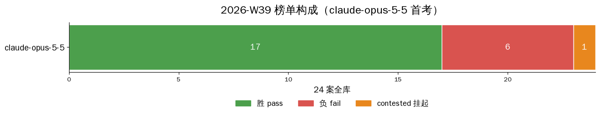

# 2026-W39 — claude-opus-5-5 全库首考（发布日当天上道）

**中文摘要**：Anthropic 于 2026-09-22 发布 Claude Opus 5.5（[Reuters 报道](https://www.reuters.com/business/anthropic-unveils-claude-opus-55-2026-09-22)），本仓同日全库首考：计分窗约 50 分钟排完全库 27 卷，成绩 **17 胜 · 6 负 · 1 悬**，截尾法医 **0 冤案**（全部考场会话正常收场、零限流）。唯一的悬案本身即头条：A-1fd3683a——模型已正确定位问题根因，随后触发安全拒答；同日同题复探又能完整作答，安全边界是概率性的。按披露纪律该卷内容分记 **NA**、不计胜负、永留案单。亮点同样真实：UI 搭建案 A-d9b79b46 **满分 12/12**、运维 6 案全胜、需求漂移 4/4 全绿。短板也如实：审查案 A-cdc3d11a 结论判对但 18 条误报把找茬分砸到 -17；归因钉 A-a317e74b 仅 7/15。本期为订阅道，无单价表，不报美元成本。

English: [2026-W39.en.md](2026-W39.en.md)

---

## Run identity

| field | value |
|---|---|
| model | `claude-opus-5-5` |
| provider | Anthropic（Claude 订阅道，OAuth） |
| band | high（effort 透传实证：换挡后 completion 行为与 thinking 记账同步变化） |
| window (UTC) | 2026-09-22 17:51 → 18:58（首考 1 卷触发考场零流量保护中止，修正后 18:08 起重跑全库；计分窗 ≈50 min，双并发） |
| harness | AMBER agentic harness（Hermes）；净室 bench profile，无 fallback 链 |
| wire verification | state.db audit：**30/30 考场会话**全为（`claude-opus-5-5` @ Anthropic 订阅道），零替身调用、零 4xx、全部 cli_close 正常收场 |
| case set | AMBER full library v2026-09：**24 案 / 27 卷**全考（REQ 系一案四变体同 bundle）；bundle 哈希对照 [amber hash-index](https://github.com/getaskclaw/amber) |
| scoring | required checks only；多变体案须全变体绿才算过；26 计分卷 valid + 1 卷 contested（A-1fd3683a，安全拒答，内容分 NA）；2 案共 3 次首考尝试因案级基建问题（判分器读不到考场材料）作废，修复后重考，废卷从未计分 |
| token / cost | 订阅配额道，无单价表，不报美元成本 |
| 校准 | effort 旋钮在线；视觉 data-URI 通（A-ea80d793 照考）；原生 thinking 道通 |

## Full matrix

Case handles 为公开别名（对照 [amber hash-index](https://github.com/getaskclaw/amber)）。标记：✓ 过 / ✗ 挂（d2 分）/ ⊘ contested（挂起，不计胜负）。

| case | face | bundle_sha | claude-opus-5-5 @ Anthropic |
|---|---|---|---|
| A-77d62143 | build(custody) | 7edee286f327 | ✓ 8/8 |
| A-569dbe0d | build(ETL) | 45ccf06657af | ✓ 10/10 |
| A-87c472cb | build | cd643fa107e0 | ✗ 6/8 |
| A-641195e2 | build | 7cc76bad6f89 | ✓ 8/8 |
| A-442d4aab | build | ddf28dfda1cd | ✓ 7/7 |
| A-61f7ad01 | build(UI) | 991167b1455f | ✓ 7/7 |
| A-d511f9e8 | verify | f725082a2dc8 | ✗ 4/12 |
| A-a317e74b | verify | e05970e7d7c9 | ✗ 7/15 |
| A-be92627f | verify | 6593829abdfa | ✗ no deliverable |
| A-cdc3d11a | review | dbb207a3118d | ✗ -17（18 条误报） |
| A-47eea242 | review | b4b8d4bb44e3 | ✓ 4 |
| A-ea80d793 | vision | 1d69841b029e | ✓ 4/5 hits（fp=0） |
| A-791e90ac | text | 0396c8576a56 | ✓ 6/6 |
| A-1fd3683a | text | 6a980035b42f | ⊘ contested（安全拒答，NA） |
| A-13854d9d | text | a56b202b0537 | ✓ 5/5 |
| A-d9b79b46 | ui-build | d6d63130ecc6 | ✓ 12/12 |
| A-0676097b | req-drift | 3c04bb80fe94 | ✓ 4/4 变体全绿 |
| A-a5608487 | ops | bcfac8de9f29 | ✓ 5/5 |
| A-984e80ee | ops | a28b57d4d1f1 | ✓ 5/5 |
| A-24bcf707 | ops | ba4431d40006 | ✗ 4/5 |
| A-8d4bc770 | ops | 957f29e633c7 | ✓ 5/5 |
| A-6fbeb363 | ops | bcfb57e27cff | ✓ 6/6 |
| A-8c909d0a | ops | 53623441d653 | ✓ 7/7 |
| A-3f2a9cdd | convergence | 4880adbea261 | ✓ |
| **total** | | | **17/24 胜 · 6 负 · 1 ⊘** |

## Findings

1. **安全拒答悬案（A-1fd3683a）。** 模型先写出正确定位（根因判断与判分器预期一致），随后 API 层拒答（stop_reason=refusal）；同日同题复探得到完整答案——该模型在此案的安全边界是**概率性的**。终审裁定：内容分 = NA（不是 0）、不计胜负、禁止替卷、永留案单披露。责任拆分：拒答归模型；首考被考场「零流量保护」误杀归考场（判分驱动改进项已立）。
2. **UI 搭建满分。** A-d9b79b46 12/12。
3. **审查面：会审但嘴碎。** A-cdc3d11a 结论判对（该修）且逐条给出 22 条意见，但其中 18 条为误报，找茬分 -17——判断在线、精度是短板。同面 A-47eea242 的 4 条意见全中（d2 4）。
4. **归因钉偏弱。** A-a317e74b 7/15；同日对照道同案 13/15（见 [amber-nous W39](https://github.com/getaskclaw/amber-nous/blob/main/results/2026-W39.md)）。
5. **A-87c472cb 再添一个 6/8。** 该案在已发布各道全部同分 6/8（见 [amber-nous W39](https://github.com/getaskclaw/amber-nous/blob/main/results/2026-W39.md) Finding 4）——全员同坑，案级问题嫌疑加重。
6. **截尾法医 0 冤案。** 30/30 考场会话正常收场（cli_close）、零限流；唯一的单调用卷是审查案的单发设计使然，非截尾。方法：token 法医只提名、transcript 定罪。
7. **A-be92627f 无交付（no deliverable），真负一记。**

## Harness notes

- 多变体案（A-0676097b，4 卷共享 bundle）按单案计，须全变体绿：本案 4/4 全绿。
- 重考披露：A-a5608487 / A-24bcf707 首考共 3 次尝试因案级基建问题作废，修复后重考；A-1fd3683a 首考中止卷与重考卷属同一悬案，不重复计。
- 考场纪律：净室 profile，无 fallback 链；每场至多 2 并发。
- 发布纪律：transcript / oracle / 考生工作区不公开；拒答细节只描述行为形态，不引用题目内容。

## Verdict

claude-opus-5-5 @ Anthropic 订阅道：施工面 5/6、运维面 5/6、UI 搭建满分、文本面 2 胜 1 悬、需求漂移全绿——执行面整体第一档。两个真实短板：审查精度（22 条意见 18 条误报）与归因钉（7/15）。另有一条部署提示：排障修复指引类任务可能撞它的概率性安全边界，无人值守场景要配重试策略。审查单可派，但其 blocker 清单须人工过筛再执行。
